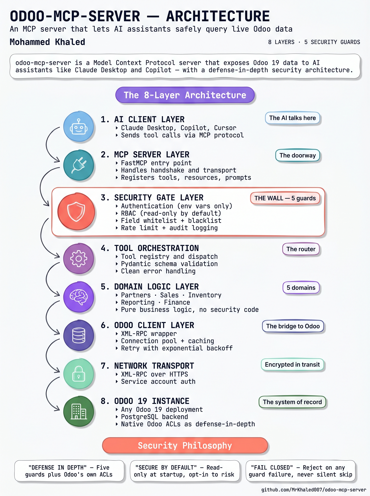

# odoo-mcp-server

**An MCP server that lets AI assistants safely query live Odoo 19 data — with a defense-in-depth security layer.**

> 🚧 **Active development.** v1 targeted for end of June 2026. The architecture, security model, and tool catalog are locked. Code is being added incrementally — check the [Roadmap](#roadmap) for live status.



---

## Table of Contents

- [Why this exists](#why-this-exists)
- [What v1 delivers](#what-v1-delivers)
- [Architecture](#architecture)
- [The 5 Tools](#the-5-tools)
- [The 2 Resources](#the-2-resources)
- [Security Model](#security-model)
- [Tech Stack](#tech-stack)
- [Quick Start](#quick-start)
- [Configuration](#configuration)
- [Roadmap](#roadmap)
- [Out of Scope (for now)](#out-of-scope-for-now)
- [About](#about)
- [License](#license)

---

## Why this exists

Odoo's product direction includes a growing surface of AI/LLM-powered features: AI-computed fields, conversational agents, voice-to-text, OCR, and intelligent document parsing — all leveraging external LLMs through inference APIs. These features need a clean, safe way for AI systems to read live business data without becoming an attack surface.

The Model Context Protocol (MCP) is the open standard that connects AI assistants to external data sources and tools. As of 2026, every major AI client supports it — Claude Desktop, GitHub Copilot, Cursor, Continue, and others.

`odoo-mcp-server` is what happens when those two worlds meet. It exposes a curated, security-hardened slice of Odoo to any MCP-compatible AI assistant, so users can:

- Ask Claude "What were our top customers last quarter?" and get a real answer from live Odoo data.
- Ask Copilot "Which products are running low?" while writing code, without switching context.
- Build internal AI agents that can read sales, inventory, and finance data without being granted database-level access.

It is built **outside** Odoo on purpose. The server speaks to Odoo over XML-RPC — meaning it works with any Odoo 19 deployment (community, enterprise, on-premise, or odoo.sh) without modifying the Odoo instance itself.

---

## What v1 delivers

By end of June 2026:

- ✅ 5 read-only tools covering partners, sales, inventory, and finance
- ✅ 2 resources (schema introspection + company info)
- ✅ Full security layer: authentication, RBAC, field whitelisting, rate limiting, audit logging
- ✅ Docker Compose setup that boots Odoo 19 + Postgres + the MCP server in one command
- ✅ Tested end-to-end against Claude Desktop
- ✅ Demo video showing a real conversation with Claude over live Odoo data
- ✅ Standalone design document (`AI_INTEGRATION_DESIGN.md`) discussing LLM-ERP integration trade-offs

---

## Architecture

The server is structured as 8 layers, each with a single responsibility. Each layer can only talk to the one directly below it — security is enforced at Layer 3, before any tool code runs, so it can never be bypassed by adding a new tool.

See the diagram above for the visual overview. In short:

1. **AI Client Layer** — Claude Desktop, Copilot, Cursor, or any MCP client
2. **MCP Server Layer** — FastMCP entry point, handshake, transport
3. **Security Gate Layer** — Auth, RBAC, field whitelist, rate limit, audit (the wall)
4. **Tool Orchestration** — Registry, dispatch, Pydantic schema validation
5. **Domain Logic Layer** — Partners, sales, inventory, reporting, finance
6. **Odoo Client Layer** — XML-RPC wrapper, connection pool, cache
7. **Network Transport** — XML-RPC over HTTPS, service account auth
8. **Odoo 19 Instance** — Any deployment, with native ACLs as defense-in-depth

A full breakdown of each layer's responsibilities and rationale lives in [`docs/AI_INTEGRATION_DESIGN.md`](docs/AI_INTEGRATION_DESIGN.md) (coming in v1).

---

## The 5 Tools

All tools in v1 are read-only. Each goes through the security layer before reaching Odoo.

### 1. `search_partners`

Find customers, suppliers, or contacts by name, country, or customer flag.

| Input | Type | Description |
|---|---|---|
| `name` | string (optional) | Partial name match |
| `country` | string (optional) | Two-letter country code |
| `customer_only` | bool (default true) | Filter to active customers |
| `limit` | int (default 20, max 100) | Max records to return |

Returns: list of partner records with id, name, email, country, customer flag.

### 2. `list_sale_orders`

List sales orders with date and state filters.

| Input | Type | Description |
|---|---|---|
| `date_from` | ISO date (optional) | Inclusive lower bound |
| `date_to` | ISO date (optional) | Inclusive upper bound |
| `state` | enum (optional) | `draft`, `sent`, `sale`, `done`, `cancel` |
| `limit` | int (default 20, max 100) | Max records to return |

Returns: list of orders with id, name, partner, total, state, date.

### 3. `check_stock`

Inventory levels for a product, optionally filtered by warehouse.

| Input | Type | Description |
|---|---|---|
| `product_name` | string | Partial product name match |
| `warehouse_id` | int (optional) | Restrict to one warehouse |

Returns: list of products with quantity on hand per warehouse.

### 4. `revenue_summary`

Aggregated sales revenue over a date range, grouped by a chosen dimension.

| Input | Type | Description |
|---|---|---|
| `date_from` | ISO date | Start of period |
| `date_to` | ISO date | End of period |
| `group_by` | enum | `customer`, `product`, `month`, `country` |

Returns: list of aggregate rows with the grouping key and total revenue.

### 5. `unpaid_invoices`

Accounts receivable status — invoices that are open or overdue.

| Input | Type | Description |
|---|---|---|
| `overdue_only` | bool (default false) | Show only past-due invoices |
| `limit` | int (default 20, max 100) | Max records to return |

Returns: list of invoices with id, partner, amount, due date, days overdue.

---

## The 2 Resources

Resources are read-only context endpoints that AI clients can subscribe to.

### `odoo://schema`

Lists the Odoo models the server can read and their accessible fields, after the field whitelist is applied. Useful for an AI client to discover what it can ask for.

### `odoo://company`

Returns the current Odoo company record — name, country, currency, VAT, fiscal year setup. Provides context for any aggregation or reporting question.

---

## Security Model

This layer is the project's center of gravity. It sits above all tool code and is enforced for every request, before any business logic runs.

### Guard 1 — Authentication

- Odoo credentials are loaded from environment variables only — never from tool parameters.
- API keys (Odoo 14+) are supported and recommended over passwords.
- The Odoo user the server authenticates as is intended to be a dedicated **service account**, never a real human user. This account should have minimum-necessary Odoo ACLs configured *in Odoo itself* — defense in depth.

### Guard 2 — Authorization (RBAC)

- Each tool declares its required permission level: `read` or `write`.
- The server boots with a permission profile (default: `read`).
- Write tools refuse to register if write mode is disabled.
- The profile is loaded from env var at startup and cannot change at runtime.

### Guard 3 — Field Whitelisting

- Every tool declares which Odoo model fields it can read.
- A central `FIELD_WHITELIST` enforces this before any `read()` call hits Odoo.
- A `FIELD_BLACKLIST` of always-rejected fields includes `password`, `password_crypt`, `api_key`, `signature`, and binary image fields.

### Guard 4 — Rate Limiting & Hard Caps

- Per-client request rate: 60 calls/minute (configurable).
- Per-tool concurrency cap: 5 simultaneous heavy-aggregate queries.
- Hard cap on result set size: **100 records per call**, configurable down only.
- Query timeout: 10 seconds, prevents long-running queries from hanging the server.

### Guard 5 — Audit Logging

- Every tool call is logged before execution: timestamp, tool name, parameters (sensitive ones redacted), client identifier.
- Every result is logged after execution: success/failure, record count, duration.
- Logs are written to rotating files in append-only mode.
- Never log full result payloads — only metadata.

### Security Defaults (Locked)

| Setting | Default | Override |
|---|---|---|
| Permission mode | `read` | `MCP_PERMISSION_MODE=write` |
| Max records per call | 100 | `MCP_MAX_RECORDS` (ceiling 500) |
| Query timeout | 10 seconds | `MCP_QUERY_TIMEOUT` |
| Rate limit | 60 calls/min | `MCP_RATE_LIMIT` |
| Audit log path | `./logs/audit.log` | `MCP_AUDIT_PATH` |
| Transport | stdio only | (SSE deferred to v2) |
| Master password access | Disabled | (no env override in v1) |

### Three Principles

- **Defense in depth.** Five guards plus Odoo's own ACLs on the service account. Compromising one wall does not compromise the system.
- **Secure by default, opt-in to risk.** Read-only at startup; every relaxation requires an explicit, conscious config change.
- **Fail closed, never open.** Auth fails → reject. Rate limit hit → reject. Field not whitelisted → reject. Audit log can't write → halt the server (loud failure, not silent skip).

---

## Tech Stack

| Layer | Choice | Why |
|---|---|---|
| Language | Python 3.11+ | Standard for MCP servers and Odoo |
| MCP framework | [FastMCP](https://github.com/jlowin/fastmcp) | Mature, opinionated, fast |
| Odoo connection | `xmlrpc.client` (stdlib) | Official, no extra dependency |
| Validation | Pydantic v2 | Typed schemas for every tool I/O |
| Config | Pydantic Settings + `python-dotenv` | Typed config, fails loudly on bad values |
| Testing | pytest | Standard |
| Containerization | Docker Compose | Reproducible setup: Odoo + Postgres + server |

---

## Quick Start

> ⚠️ This section will be fully functional once v1 ships. The Docker setup is being added next.

```bash
# Clone
git clone https://github.com/MrKhaled007/odoo-mcp-server.git
cd odoo-mcp-server

# Configure
cp .env.example .env
# Edit .env with your Odoo URL, database, and credentials

# Boot (Odoo + Postgres + MCP server)
docker compose up -d

# Connect Claude Desktop
# Add the server to your Claude Desktop MCP config — instructions in docs/CLAUDE_DESKTOP_SETUP.md
```

---

## Configuration

All configuration is via environment variables. See `.env.example` for the full list. Key variables:

```bash
# Odoo connection
ODOO_URL=http://localhost:8069
ODOO_DB=odoo_demo
ODOO_USERNAME=service_account
ODOO_API_KEY=<your-api-key>

# Security
MCP_PERMISSION_MODE=read           # 'read' or 'write' (write opt-in only)
MCP_MAX_RECORDS=100                # Hard cap, ceiling 500
MCP_QUERY_TIMEOUT=10               # Seconds
MCP_RATE_LIMIT=60                  # Calls per minute per client
MCP_AUDIT_PATH=./logs/audit.log
```

---

## Roadmap

### v1 — End of June 2026

- [x] Architecture and security model designed
- [x] Repo skeleton + README
- [ ] FastMCP server scaffold
- [ ] Odoo client wrapper (read-only)
- [ ] Security gate: auth, RBAC, whitelist, rate limit, audit
- [ ] 5 tools implemented and tested end-to-end with Claude Desktop
- [ ] 2 resources implemented
- [ ] Docker Compose setup (Odoo 19 + Postgres + server)
- [ ] Demo video (2 minutes)
- [ ] `AI_INTEGRATION_DESIGN.md` design document

### v2 — Future

- Write tools (create, update, unlink) gated behind explicit opt-in
- SSE/HTTP transport for remote deployments
- OAuth/API key rotation
- Connection pooling beyond single shared client
- Tests with high coverage
- PyPI release
- Multi-database support

### v3 — Long-term

- Native Odoo module wrapping the server (so Odoo admins can configure it from the Odoo UI)
- AI-computed fields as a separate companion module
- Conversational agent flows using the same data layer

---

## Out of Scope (for now)

Explicitly not in v1, by design:

- ❌ **Write tools.** Designed, not implemented. Forces the conversation: do you really want an AI writing to your ERP?
- ❌ **SSE / HTTP transport.** Stdio only — strongest default security guarantee.
- ❌ **OAuth, API key rotation.** Env vars only.
- ❌ **Production packaging.** Not on PyPI in v1. Run from source.
- ❌ **High test coverage.** Smoke tests only. Real test suite in v2.

These exclusions are not bugs — they are scope discipline. v1 ships a *correctly small* system, not an *incorrectly large* one.

---

## About

Built by **Mohammed Khaled** — final-year BSc Data Science student at Thomas More University Mechelen (Belgium), working on the intersection of AI agents and business systems.

Related open-source work:

- [OCA/reporting-engine PR #1173](https://github.com/OCA/reporting-engine/pull/1173) — USAGE documentation for `sql_export_excel`
- [github.com/MrKhaled007](https://github.com/MrKhaled007) — other projects

Portfolio: [mdkhaledportfolio.netlify.app](https://mdkhaledportfolio.netlify.app)

---

## License

[MIT](LICENSE) — do whatever you want, just don't blame me.
